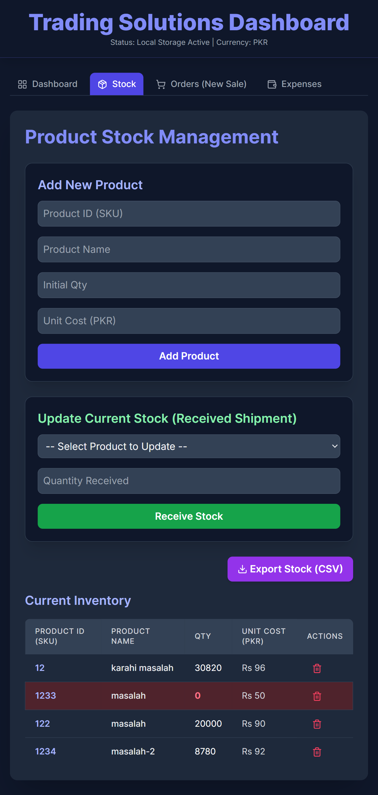
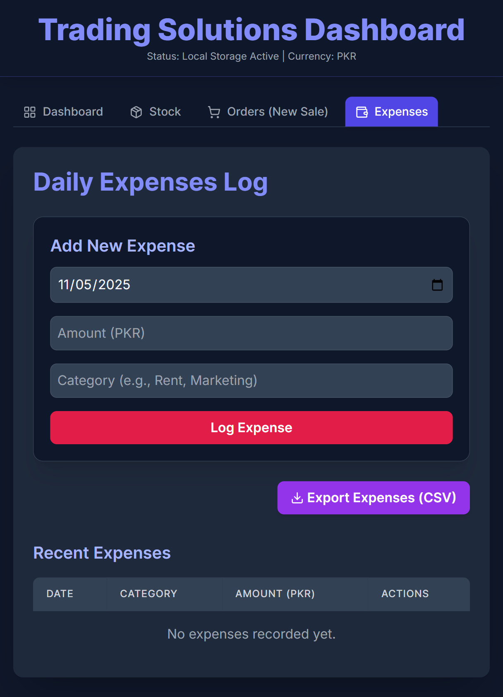

# 💼 Trading Solutions Dashboard

A **modern, responsive business dashboard** built with **HTML, Tailwind CSS, and JavaScript (ES6)**.  
It helps track **sales, expenses, profit, and credit orders**, storing all data locally using the **Local Storage API**.  
Ideal for small businesses and traders who need a **simple, user-friendly performance tracker** with a sleek dark UI.

---

## 🚀 Features
- Track total sales, expenses, and profit  
- Filter and analyze reports by date range  
- Manage outstanding credit orders  
- View daily performance summaries  
- Works completely offline using Local Storage  
- Built with **Tailwind CSS** and **custom CSS** for a clean dark theme  
- Uses **modern ES6 JavaScript** with **simple DOM manipulation**  
- Async functions for operations like deleting last month’s data  

---

## 🧰 Tech Stack
**Frontend:** HTML • Tailwind CSS • Custom CSS  
**Logic:** JavaScript (ES6) • Local Storage API • DOM Manipulation

---

## 🌐 Live Demo
👉 [View Demo](https://trading-solution-dashboard.vercel.app)  

---

## 📸 Screenshot

---

### 🔍 SEO Keywords
`trading dashboard` `tailwind css dashboard` `sales management system` `business analytics`  
`expense tracker` `JavaScript ES6` `DOM manipulation` `local storage app`  
`responsive web design` `small business tools`
